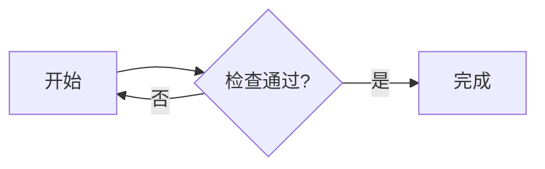

# LightMD

自用的 macOS 原生 Markdown 阅读与编辑器。用 SwiftUI 排版、Swift Markdown 解析和 AppKit 文本编辑。Swift Markdown、MathJaxSwift 与 SwiftDraw 是构建时依赖，成品包含离线公式资源，不需要另装运行时。

## 使用

双击 `LightMD.app`，按 ⌘O 或用「文件 → 打开…」读取 `.md`、`.markdown`、`.mdown`、`.txt` 文件；可一次多选，也可一次拖入多个文件。从 Finder 连续双击 Markdown 文件会继续在同一个 LightMD 窗口中打开标签。再次打开已在标签中的文件会切到原标签。点击文内的本地 Markdown 链接也会在同一窗口打开新标签；带 `#标题` 的链接会跳到对应标题。按 ⌘T 新建空白标签。

启动时为**阅读模式**，右侧目录默认收起。标题栏**右上角的同一个胶囊**里从左到右是导出 PDF、切换模式、开合目录。单击中间的模式按钮即可在阅读模式与**双栏编辑模式**间滑动切换：阅读模式只显示渲染结果；双栏编辑模式左边修改源码、右边实时预览，初始左侧占 40%、右侧占 60%，也可拖动分隔线调整。两种模式的图标分别是分栏与书本，没有下拉菜单。用鼠标滚动双栏中的任意一边，另一边会按对应内容块的位置同步。⇧⌘E 也可切换模式。系统开启「减少动态效果」时直接切换模式。

当前文件的完整路径显示在文件标签下方；未命名标签不显示路径。未选中的标签平时为灰色，鼠标悬停时文字变深并显示关闭按钮，标签宽度不跳动。

已有保存路径的文件在停止输入约 1 秒后自动保存，切换到别的标签也会继续保存；关闭标签或退出应用前会立即保存尚未写入的修改。⌘S 仍可立即保存，⇧⌘S 另存为；未保存的标签显示圆点，保存成功后圆点消失。新建的未命名文件首次需用 ⌘S 选择保存位置，之后自动保存。正常退出后，下次启动恢复文件标签、当前标签和各标签阅读位置；未命名草稿也会恢复，首次明确保存到文件仍需选择位置。若文件在编辑过程中被其他程序修改，LightMD 会保留草稿并停止覆盖该文件，可用「另存为…」保存副本；写入失败会在当前标签下提示，并保留未保存状态。

⌘2 控制目录，点击目录标题可跳转；⌘F 在当前文档查找，回车或箭头切换匹配。字号调整已合并到菜单栏「显示」，亦可用 ⌘+、⌘−、⌘0；外观跟随 macOS 系统设置。菜单栏以中文显示。

## 当前范围

支持基础 Markdown 正文、标题、列表、强调、引用、代码块、链接、表格和右侧标题目录。`.txt` 按纯文本显示，保留 `#`、`**` 等字面符号；支持 UTF-8、UTF-16 和 GB18030 等常见编码。未修改的已打开文件在外部更新后会自动刷新，并尽量保持当前阅读位置。查找基于渲染后的文本，以段落或表格行为单位标示命中。双栏预览约在停止输入 180 毫秒后更新；两侧滚动按源码行与渲染块、列表项的位置对应，块内插值同步。特别长的单个块内部仍可能有少量偏移。支持 LaTeX 数学公式、本地／相对路径图片和 Mermaid 流程图等常用图表，并可导出完整 PDF。

对 `*`、`**`、`***`、`_`、`__` 和 `~~` 加了限定的中文标点兼容规则。例如 `**结论。**后文`、`*（解释）*后文` 会正确显示；代码、转义和链接仍由 Markdown 解析器处理。实现是项目内的 `cmark-cjk-emphasis.patch`，作用于固定版本的构建依赖，不修改用户的 Markdown 原文。

正文的字体组合为：中文宋体、英文及阿拉伯数字 New York 系统衬线、中文粗体宋体 Black、中文斜体楷体、中文全角标点 SimSong。代码使用系统等宽字体。字体角色见 [字体说明](Font-notes.md)。三列表格按 19%／32%／49% 填满正文可用宽度，窗口变化时重新测量每行高度。

右侧目录开合、阅读和编辑模式切换时，预览按动画的中间宽度实时换行。预览内容块按需创建；源码滚动到尚未显示的章节时，先显示对应章节，再校正段落内的位置。系统开启「减少动态效果」时直接切换。

分隔线悬停显示左右调整光标。拖动期间左右两栏都会实时改变宽度并换行；源码使用系统的非连续排版支持，减少长文中无关段落的排版开销。松手后重新校正两侧的阅读位置。

双栏慢速滚动在段落、标题和块间空白之间连续计算对应位置，避免内容块经过视口顶部时突然吸附。

窗口上方居中显示当前文件名，作为静态文字使用。多文件以紧凑标签切换，标签下方显示当前文件路径。

LightMD 当前使用 macOS 系统文本断行。

## 公式、图片与会话恢复

- **LaTeX**：支持行内 `$…$`、`\(…\)` 和块级 `$$…$$`、`\[…\]`，包含分式、根号、上下标、积分、矩阵、分段函数及 `aligned` 多行对齐。公式离线异步渲染，宽公式可横向滚动；失败时显示原始源码。公式所在段落的右键菜单可复制带分隔符的原始 LaTeX。代码区、转义美元符号和常见价格写法不作为公式解析，保存的 Markdown 保持原文。
- **图片**：支持本地绝对路径、`file://` 和相对 Markdown 文件目录的路径，包括 URL 编码、空格与中文文件名。支持系统 ImageIO 可读取的 PNG、JPEG、HEIC 等格式，以及 SVG；动图当前显示首帧。图片按比例缩放，点击使用系统快速查看显示原图，缺失文件显示占位提示。网络图片暂不加载。
- **会话**：标签顺序、当前标签、按内容块记录的阅读位置及未命名草稿保存在 `~/Library/Application Support/LightMD/session.json`。普通文件从磁盘重新读取，仅未保存的修改另存为会话草稿；退出时先尝试保存已有路径的修改，再原子写入会话。恢复草稿时若磁盘内容已变化或文件不可读，保留草稿并阻止覆盖，可「另存为…」处理。会话损坏时先保留原文件备份。已关闭的标签不再恢复，无法读取且没有草稿的文件会跳过。

HTML 预览沿用 `LightMD-preview.html`，包含固定公式样例、图片放大、真实 Mermaid 编辑渲染、浏览器打印存储为 PDF 和会话恢复演示；浏览器只保存自己的预览数据，不会写回 Markdown 文件。

## PDF 导出与 Mermaid

右上角胶囊的左侧新增「导出 PDF」图标，也可使用「文件 → 导出 PDF…」或 ⌥⌘E。选择保存位置后，以点击时当前标签的最新源码生成完整 A4 PDF，四边边距约 12.7 毫米。导出包含尚未自动保存、或尚未刷新到预览的编辑；处理过程中按钮显示进度并避免重复导出。PDF 正文可选择和搜索，表格可跨页，公式、图片与流程图一并排版；超出单页的图形缩放到页内。不会把文件标签、源码编辑栏或右侧目录输出到 PDF。

PDF 先在临时目录完成排版和有效性检查，再原子写入所选位置。资源无法渲染时保留源码或占位，并在导出完成后提示；源文件和已有目标文件在导出失败前不会被替换。公式使用矢量 SVG，不能承诺在 PDF 中直接复制回 LaTeX 源码。

使用标记为 `mermaid` 的代码围栏：

````markdown

````

图表离线异步生成，支持中文、连线标签、分支、循环及常见时序图；随编辑更新、随栏宽缩放，外观跟随明暗模式。右键图表可复制源码。语法错误时显示提示与原代码，不会改写文件。固定使用官方 Mermaid Tiny 11.17.2，不包含架构图、思维导图、ELK 布局或图内 KaTeX。大于 100 KB、超过 1,000 条边或绘图范围过大的图表保留源码并提示。

Mermaid 和 PDF 使用系统 WebKit 的离屏排版页，结果交回原生界面；资源随应用打包。排版页使用独立临时存储、严格图表模式和禁止外部资源访问的策略。打印使用后台分页任务，不显示打印面板、进度面板或测试窗口。原生正文界面继续使用 SwiftUI。

## 重新构建

退出正在运行的 LightMD，然后在本目录运行：

```sh
./build.sh
```

脚本核对解析器版本，应用中文标点补丁，运行 18 个解析回归样例，再以 Release 编译、打包和临时签名应用。公式资源通过固定版本的 `mathjax-app-resources.patch` 从应用 `Contents/Resources` 加载，Mermaid bundle 另做固定校验和验证，包含所需第三方许可；`Assets/AppIcon.icns` 同时放入应用包。直接运行 `swift build` 不会自动给新下载的解析器应用补丁。

项目与构建产物 `LightMD.app` 均放在 `项目目录`。若 `/Applications/LightMD.app` 已存在且 bundle ID 相同，`./build.sh` 会在构建和验签后自动更新该安装版。更新前须退出正在运行的 LightMD；Finder 的 Markdown 默认打开应用仍指向 `/Applications/LightMD.app`，以后无需反复修改默认打开选项。

功能回归可在完整构建后执行 `python3 Checks/Features/run.py`：使用隔离会话与离屏窗口，检查公式结构、源码保护、图片、退出／恢复、Mermaid 及完整 PDF 分页；还会临时隐藏构建目录中的公式资源，验证签名测试包可以独立加载资源。不会激活窗口。当前命令行工具链缺少 SwiftDraw Debug 预览宏，使用上述 Release 构建流程。

项目已启用本地 Git 跟踪。每次更改记录在 `docs/CHANGELOG.md`，性能验证记录见同目录下的 `PERFORMANCE-2026-09-27.md`。
