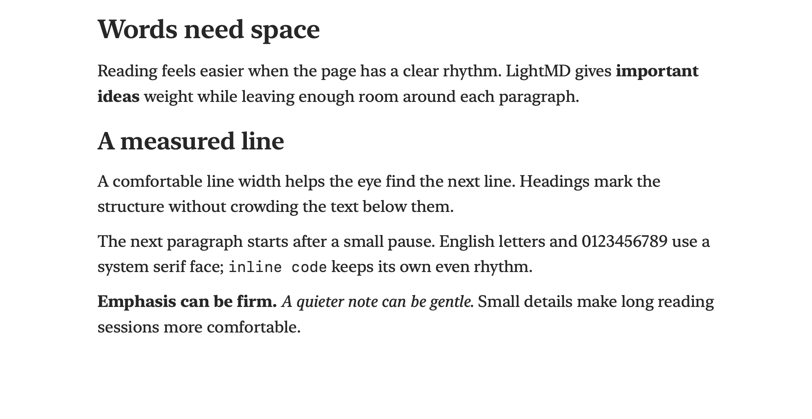
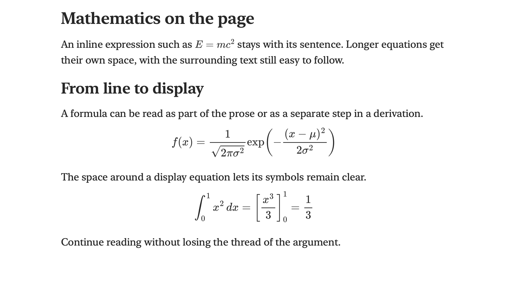

<div align="center">
  
  <h1>LightMD</h1>
  <p>A personal Markdown reader for macOS, shaped by my reading habits and taste.</p>
  <p><strong>English</strong> · <a href="README.zh-CN.md">简体中文</a></p>
</div>

## Why I made it

LightMD began with two goals:

1. **Make Markdown more pleasant to read.** Give Chinese and English text a clear visual rhythm, comfortable spacing, and mathematics that belongs on the page.
2. **Keep power use on macOS in mind.** Render visible content on demand, combine rapid edits before updating the preview, and cache expensive results.

This is a reader I made for my own daily use, with features and typography chosen around my preferences. I hope it is useful to others too. Suggestions about readability, performance, or small points of friction are welcome in [Issues](https://github.com/herzzlic1125/LightMD/issues). Power efficiency is a design goal; battery impact has not yet been measured across different Macs.

## Reading preview

### Typography and spacing

<p align="center">
  
  <br>
  <sub>Native reading view at 20 pt · <a href="docs/examples/reading-en-type.md">sample Markdown</a></sub>
</p>

### LaTeX in context

<p align="center">
  
  <br>
  <sub>Native math rendering at 20 pt · <a href="docs/examples/reading-en-math.md">sample Markdown</a></sub>
</p>

## What it does

- Read multiple Markdown files in one window, including files opened from Finder, dropped into the window, or reached through local document links.
- Switch between reading and a two-pane editor. Drag the divider to resize both panes; scroll positions follow corresponding content.
- Read headings, lists, tables, code, and local images with search and a heading outline.
- Render inline and display LaTeX mathematics offline.
- Save named files automatically after a short pause. Detect outside changes and preserve conflicting drafts.
- Restore tabs, the selected file, reading positions, and untitled drafts.
- Export the entire document as an A4 PDF, including text, mathematics, and images.
- Follow the system's light and dark appearance and Reduce Motion setting.

## Shortcuts

| Action | Shortcut |
| --- | --- |
| Open files | ⌘O, or drop files into the window |
| New tab | ⌘T |
| Save / Save As | ⌘S / ⇧⌘S |
| Switch reading and editing modes | ⇧⌘E, or the middle button at the upper right |
| Show or hide the outline | ⌘2, or the right button at the upper right |
| Find | ⌘F |
| Export PDF | ⌥⌘E, or the left button at the upper right |
| Change text size | ⌘+ / ⌘− / ⌘0 |

The first two-pane view starts at 40% source and 60% preview. Both sides reflow while you drag the divider. A new untitled file needs a location on its first save. When a file changes outside LightMD, the app preserves your draft and offers Save As rather than overwriting that change. Session data is stored at `~/Library/Application Support/LightMD/session.json`.

Mathematics supports `$…$`, `$$…$$`, `\(…\)`, and `\[…\]`. Failed expressions remain visible as source.

## Build from source

The repository includes the source and its paper-and-bookmark icon. It does not provide a precompiled application.

The minimum configured runtime is macOS 13. Building requires a Swift 6.0 or newer toolchain and a macOS SDK. Development and verification have mainly used Apple silicon; older systems and Intel Macs have not yet been fully checked. The first build needs network access for pinned dependencies. Runtime math resources are bundled into the app.

```sh
git clone https://github.com/herzzlic1125/LightMD.git
cd LightMD
./build.sh
```

By default, the script builds and signs `LightMD.app` in this directory. To also install it in `/Applications`, quit a running copy normally and run `./build.sh --install`. The ad hoc signature is not notarization, so macOS may ask you to confirm opening the app in Privacy & Security.

## Checks and scope

```sh
python3 Checks/Features/run.py
python3 Checks/Features/check-preview.py
```

The first command runs isolated, offscreen checks for rendering, editing, recovery, and PDF export. The second checks the standalone HTML preview and requires Node.js. Neither test displays or activates a window. `LightMD-preview.html` uses example content and browser storage; it does not write to Markdown files.

Current limits: network images are not loaded; animated images show their first frame; PDF uses A4 with fixed margins. A very long individual content block may still have a small scroll alignment offset between panes. Feedback on readability, battery use, and hardware compatibility is especially helpful.

## Contribute

Issues and pull requests are welcome. For a bug, include the macOS and LightMD versions, steps to reproduce it, and a small Markdown example with private information removed. See [CONTRIBUTING.md](CONTRIBUTING.md).

[Icon design](docs/ICON.md) · [Changelog](docs/CHANGELOG.md) · [Typography notes](Font-notes.md) · [Validation notes](docs/PUBLICATION-0.17.1.md)

## License

Original project code and documentation are available under the [MIT License](LICENSE). Third-party components keep their own licenses; see [ThirdPartyNotices.md](ThirdPartyNotices.md).
