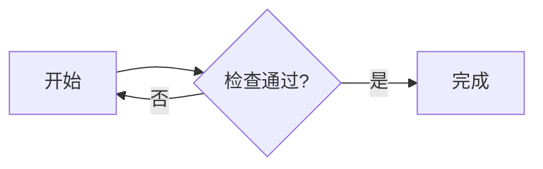

# LightMD


一个为个人日常使用而制作的 macOS Markdown 阅读器，也提供简单的编辑功能。

LightMD 的排版、交互和功能选择，主要按照我自己的阅读习惯与个人喜好来实现。把它公开，是希望有类似需求的人也能用上，并一起让它变得更顺手。

**欢迎大家提出优化意见、反馈问题，或提交改进。** 无论是阅读体验、中文排版、长文性能，还是某个不顺手的小细节，都欢迎在 Issues 中讨论。项目由个人维护，功能取舍和更新节奏会结合实际使用需求与可投入的时间。

## 功能

- 多标签阅读 Markdown，支持 Finder 打开、拖入文件和本地文档链接。
- 阅读模式与双栏编辑模式，左右宽度可拖动调整，按内容位置同步滚动。
- 中文排版、列表、表格、代码、搜索和标题目录。
- 已有路径的文件停止输入约 1 秒后自动保存，保留外部修改冲突检查。
- 恢复标签、阅读位置和未命名草稿。
- 离线 LaTeX 数学公式，支持行内及块级公式。
- 本地／相对路径图片，点击查看原图。
- 离线 Mermaid 流程图及常见时序图。
- 导出完整 A4 PDF，包含正文、表格、公式、图片和图表。
- 系统明暗外观和“减少动态效果”。

## 使用

| 操作 | 入口 |
| --- | --- |
| 打开文件 | ⌘O，或拖入文件 |
| 新建标签 | ⌘T |
| 保存／另存为 | ⌘S／⇧⌘S |
| 切换阅读和编辑模式 | 右上角中间按钮，或 ⇧⌘E |
| 显示／隐藏目录 | 右上角右侧按钮，或 ⌘2 |
| 查找 | ⌘F |
| 导出 PDF | 右上角左侧按钮，或 ⌥⌘E |
| 调整字号 | ⌘+、⌘−、⌘0 |

第一次进入双栏时，源码和预览默认占 40%／60%。拖动分隔线时两侧都会实时换行。

未命名文件首次保存需要选择位置；已有路径的文件自动保存。如果文件在外部被修改，应用会保留草稿并提示冲突，可另存为副本。会话与草稿保存在 `~/Library/Application Support/LightMD/session.json`。

公式支持 `$…$`、`$$…$$`、`\(…\)` 和 `\[…\]`。Mermaid 使用标记为 `mermaid` 的代码围栏：

````markdown

````

## 从源码构建

当前发布源码和为本项目生成的纸张字标图标，暂不提供预编译安装包。

运行最低配置为 macOS 13。构建需要 Swift 6.0 或更新的工具链及 macOS SDK。开发和验证以 Apple silicon 为主；旧系统及 Intel Mac 尚未完成验证。首次构建需要联网下载固定版本依赖，运行时的公式和图表资源随应用打包。

```sh
git clone https://github.com/herzzlic1125/LightMD.git
cd LightMD
./build.sh
```

默认只生成项目目录下的 `LightMD.app`，不会修改 `/Applications` 中的应用。需要安装时，先正常退出正在运行的 LightMD，再执行：

```sh
./build.sh --install
```

构建脚本会核对依赖版本、应用项目补丁、执行 18 个 Markdown 解析检查，随后打包并进行本地临时签名。构建产物未经开发者公证，系统可能要求你在隐私与安全性设置中确认打开。

## 验证与预览

```sh
python3 Checks/Features/run.py
python3 Checks/Features/check-preview.py
```

前者进行离屏功能检查，包括公式、图片、草稿、图表与 PDF；后者检查 HTML 结构和 JavaScript，需要本机提供 Node.js。测试使用隔离文件，不读写个人会话，不显示或置顶测试窗口。

`LightMD-preview.html` 是独立的交互预览，可以自行在浏览器中打开。它使用示例数据和浏览器本地存储，不会写回本地 Markdown；公式为代表样例，原生应用支持的公式范围更广。

## 当前边界

- 图片以本地文件为主，暂不加载网络图片；动图显示首帧。
- Mermaid 使用官方 Tiny 版本，不包含架构图、思维导图、ELK 布局或图内 KaTeX。
- PDF 固定 A4 与约 12.7 mm 边距，暂无纸型及页眉页脚设置。
- 特别长的单个内容块，两侧滚动位置仍可能有少量偏移。
- 不支持的公式和图表会保留源码并提示。
- 节能和多机型兼容性仍有继续完善的空间。

## 参与改进

欢迎提交 Issue 或 Pull Request。问题反馈请附上系统版本、复现步骤和不包含私人信息的最小 Markdown 示例；涉及排版时可以附截图。详细说明见 [贡献指南](CONTRIBUTING.md)。

[图标说明](docs/ICON.md) · [更改记录](docs/CHANGELOG.md) · [字体说明](Font-notes.md) · [验证记录](docs/EXPORT-0.17.0.md)

## 许可与依赖

本项目原创代码和文档采用 [MIT License](LICENSE)，允许使用、修改和商用，分发时请保留版权及许可声明。第三方组件仍遵循各自的许可证，见 [第三方许可说明](ThirdPartyNotices.md)。
