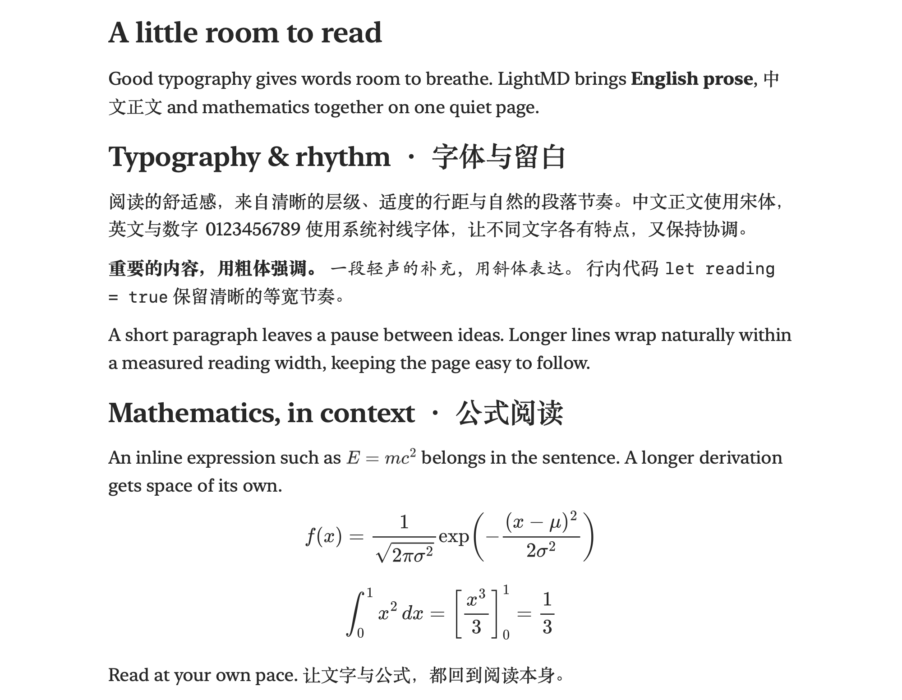

<div align="center">
  
  <h1>LightMD</h1>
  <p>按自己的阅读习惯与审美偏好制作的 macOS Markdown 阅读器。</p>
  <p><a href="README.md">English</a> · <strong>简体中文</strong></p>
</div>

## 为什么做 LightMD

我做这个应用有两个初衷：

1. **让 Markdown 更好看、更适合长时间阅读。** 关注中英文字体搭配、层级、行距和段落节奏，让数学公式也能自然地融入页面。
2. **尽量降低 macOS 上的功耗。** 按需排版当前可见的内容，合并连续输入后的预览更新，并缓存计算成本较高的渲染结果。

LightMD 首先服务于我自己的日常阅读，因此功能和排版带有很强的个人选择。欢迎在 [Issues](https://github.com/herzzlic1125/LightMD/issues) 中提出排版、性能或交互优化建议。省电是设计目标；目前还没有覆盖不同 Mac 的系统性能耗测试。

## 阅读效果

<p align="center">
  
  <br>
  <sub>使用<a href="docs/examples/reading.md">这份示例 Markdown</a>，在 20 点字号下离屏捕获的原生阅读视图。图中展示了实际文字间距与 LaTeX 渲染结果。</sub>
</p>

## 功能

- 单窗口多标签阅读，支持 Finder 打开、拖入文件和本地文档链接。
- 阅读模式与双栏编辑；拖动分隔线时左右实时换行，滚动位置按内容对应。
- 标题、列表、表格、代码、本地图片、查找和目录。
- 离线显示行内与块级 LaTeX 数学公式。
- 已有路径文件停止输入后自动保存，检测外部修改并保留冲突草稿。
- 恢复标签、当前文件、阅读位置和未命名草稿。
- 导出包含正文、公式和图片的完整 A4 PDF。
- 跟随系统明暗外观与“减少动态效果”设置。

## 常用操作

| 操作 | 快捷键 |
| --- | --- |
| 打开文件 | ⌘O，或拖入文件 |
| 新建标签 | ⌘T |
| 保存／另存为 | ⌘S／⇧⌘S |
| 切换阅读和编辑模式 | ⇧⌘E，或右上角中间按钮 |
| 显示／隐藏目录 | ⌘2，或右上角右侧按钮 |
| 查找 | ⌘F |
| 导出 PDF | ⌥⌘E，或右上角左侧按钮 |
| 调整字号 | ⌘+、⌘−、⌘0 |

首次进入双栏时，源码与预览默认占 40%／60%。未命名文件第一次保存需要选择位置。文件在外部修改后，应用会保留当前草稿，允许另存为副本。会话与草稿保存在 `~/Library/Application Support/LightMD/session.json`。

数学公式支持 `$…$`、`$$…$$`、`\(…\)` 与 `\[…\]`；无法识别时保留源码。

## 从源码构建

仓库包含源码和纸张书签图标，目前不提供预编译应用。

运行最低配置为 macOS 13；构建需要 Swift 6.0 或更新的工具链及 macOS SDK。开发与验证主要使用 Apple silicon，旧系统及 Intel Mac 尚未充分测试。首次构建需要联网下载固定版本依赖，运行时数学资源随应用打包。

```sh
git clone https://github.com/herzzlic1125/LightMD.git
cd LightMD
./build.sh
```

默认在当前目录生成并签名 `LightMD.app`。若要同时安装到 `/Applications`，先正常退出运行中的版本，再执行 `./build.sh --install`。本地临时签名不等于公证，macOS 可能要求你在“隐私与安全性”中确认打开。

## 验证与当前范围

```sh
python3 Checks/Features/run.py
python3 Checks/Features/check-preview.py
```

第一条使用隔离文件离屏检查渲染、编辑、恢复和 PDF；第二条验证独立 HTML 预览，需要 Node.js。测试不显示或激活窗口。`LightMD-preview.html` 使用示例数据与浏览器存储，不写回 Markdown 文件。

目前不加载网络图片；动图只显示首帧；PDF 固定 A4 和边距。特别长的单个内容块，两栏定位仍可能有少量偏移。欢迎反馈阅读体验、耗电表现和不同硬件上的兼容情况。

## 参与改进

欢迎提交 Issue 或 Pull Request。报告问题时，请附上 macOS 与 LightMD 版本、复现步骤，以及去除私人内容后的最小 Markdown 示例。详见 [贡献指南](CONTRIBUTING.md)。

[图标说明](docs/ICON.md) · [更改记录](docs/CHANGELOG.md) · [字体说明](Font-notes.md) · [验证记录](docs/PUBLICATION-0.17.1.md)

## 许可

项目原创代码和文档采用 [MIT 许可证](LICENSE)；第三方组件遵循各自许可，见 [第三方许可说明](ThirdPartyNotices.md)。
